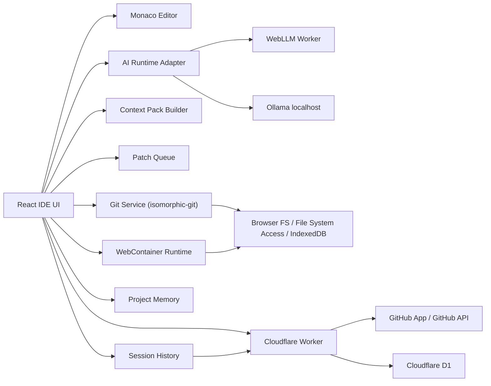

# Git AI IDE PRD / アーキテクチャ / MVP マイルストーン

## プロダクト概要

Git AI IDE は、GitHub の Branch to PR フローを、ローカル LLM と一緒に安全に進めるための Git-aware ブラウザ IDE です。

単なる「エディタ横にチャットがあるツール」ではありません。リポジトリの状態、ブランチの目的、差分、実行ログ、AI の修正提案を IDE 側が理解し、ユーザーが確認しながら安全に変更を適用できる体験を目指します。

一番のアピールポイントは **AI workflow safety** です。

AI に自由にファイルを書き換えさせるのではなく、AI は構造化された修正案を出し、IDE が検証し、ユーザーが diff を確認してから適用します。

公開は Cloudflare Pages を前提にし、推論は WebLLM または Ollama でユーザー端末側に寄せます。これにより、公開後も無料で維持しやすい構成にします。

## 解決したい課題

AI コーディングツールには便利さがある一方で、次のような問題があります。

- AI にどの文脈が渡されたのか分かりにくい
- AI の編集範囲が広すぎて危険
- 小さなローカル LLM は曖昧で大きなタスクに弱い
- ブラウザ AI デモはチャットだけで終わりがち
- 採用担当者が試すには、ログインやモデルロードの手間が重い

Git AI IDE は、Branch Goal、Context Pack、Patch Queue、Safety Checklist、Diff Preview、テスト、commit、push、PR 作成を明示的なワークフローとして扱います。

## 目標

- GitHub の Branch to PR フローをブラウザ IDE で扱えるようにする
- GitHub App により、選択した repo のみ連携できるようにする
- Cloudflare Worker で GitHub 認証と API proxy を担当する
- Cloudflare D1 に Branch to PR workflow metadata を保存する
- branch、diff、commit、push、merge、PR 作成を扱う
- WebLLM を primary なローカル AI runtime にする
- Ollama を first-class fallback として扱う
- Context Pack により、AI に渡す文脈を可視化・調整できるようにする
- AI の修正提案を Structured Edit Operation に制約する
- AI の patch を Patch Queue に積み、diff review 後に適用する
- PR 作成前に Soft Gate で未確認項目を警告する
- Demo Repo + Recorded AI Mode で、面接官がすぐ体験できるようにする

## やらないこと

- VS Code 完全互換
- あらゆる言語への LSP 対応
- AI による完全自律実装
- 複数人同時編集
- クラウド LLM 推論
- クラウド上での workspace 永続化
- コード本文や diff 本文のサーバー DB 保存
- PR 作成を強制的に止める hard gate
- すべての言語・フレームワークの runtime 実行保証

## 想定ユーザー

主なユーザーは、GitHub リポジトリをブラウザで開き、ローカル LLM と一緒に差分理解、小さな修正、commit、push、PR 作成まで進めたい開発者です。

副次的なユーザー:

- ポートフォリオを見る採用担当者
- ローカルファーストな AI コーディング UX に興味があるエンジニア
- クラウド AI を使いにくい環境の開発者

## コア原則

**LLM は提案する。IDE が検証する。ユーザーが適用する。Git が記録する。**

AI の出力をそのまま信頼しません。すべての変更は次の流れを通します。

- Branch Goal
- Context Pack
- model capability check
- Structured Edit Operation parsing
- target text matching
- Patch Queue
- Diff Preview
- user approval
- Git diff verification

## メインフロー: Branch to PR Flow

1. ユーザーが Git AI IDE を開く
2. Demo Mode か GitHub 接続を選ぶ
3. GitHub App で選択 repo のみ許可する
4. repo を開く
5. IDE が Repo Map を生成する
6. branch を作成する
7. Structured editable Markdown で Branch Goal を書く
8. Branch to PR panel が進捗を表示する
9. ユーザーが手動編集、または AI に小さな修正案を依頼する
10. IDE が Context Pack を作る
11. LLM が diff 説明、リスク、テスト観点、修正案を返す
12. 修正案は Patch Queue で検証される
13. ユーザーが diff を確認し、適用 / 部分適用 / 却下を選ぶ
14. WebContainer が対応できる場合はテストや preview を実行する
15. 実行ログを Context Pack に追加できる
16. commit message を生成する
17. commit して push する
18. Soft PR Gate が未確認項目を表示する
19. PR title、description、risk、test plan を生成する
20. PR を作成する
21. PR URL と safety gate result を session history に保存する

## 主要機能

### 1. GitHub 連携

要件:

- GitHub App ベースの認証
- ユーザーが選択した repo のみにアクセス
- Cloudflare Worker が OAuth callback と token exchange を担当
- 必要に応じて Worker が GitHub API proxy になる
- アクセス可能 repo 一覧を表示
- repo を開ける
- branch 作成 / 切り替え
- commit / push / PR 作成

受け入れ条件:

- ブラウザに app secret を置かずに GitHub 接続できる
- GitHub App が install された repo を選べる
- branch を作成して push できる
- current branch から PR を作成できる

### 2. ブラウザ IDE

要件:

- File tree
- Monaco Editor
- Monaco Diff Editor
- Editor tabs
- Git status panel
- Runtime / log panel
- AI chat side panel
- Branch to PR panel
- Patch Queue
- Context Pack viewer

受け入れ条件:

- ファイルを閲覧・編集できる
- patch 適用前後の diff を確認できる
- 現在の repo、branch、model、PR flow 状態が分かる

### 3. PR flow session history

Branch to PR workflow の metadata を Cloudflare D1 に保存します。

保存するもの:

- GitHub installation id
- repository id / owner / name
- branch name
- base branch
- Branch Goal の metadata
- AI action の種類と結果 summary
- patch proposal の status
- safety checklist result
- runtime / test summary
- created PR URL
- timestamps

保存しないもの:

- コード本文
- diff 本文
- secret
- GitHub token
- LLM prompt の全文
- private file content

目的:

- ユーザーが過去の Branch to PR session を振り返れる
- AI workflow safety の履歴を可視化できる
- 面接で DB 設計と privacy-aware persistence を説明できる

受け入れ条件:

- session 一覧を表示できる
- session detail で branch goal、AI actions、patch status、safety gate result、PR URL を確認できる
- コード本文や diff 本文が D1 に保存されない
- ユーザーは session metadata を削除できる

### 4. Repo Map

repo を開いたときに IDE が生成するプロジェクト概要です。

含める情報:

- 検出した技術スタック
- 重要ファイル
- package manager
- scripts
- framework hints
- ディレクトリ概要
- runtime capabilities
- default branch
- current branch

受け入れ条件:

- Repo Map が UI で見える
- Context Pack に含められる
- 大きな変更後に再生成できる

### 5. Branch Goal

branch 開始時に作る、構造化された編集可能 Markdown です。

テンプレート:

```md
# Branch Goal

## Goal

## Context

## Acceptance Criteria

## Non-goals

## Risk Areas
```

受け入れ条件:

- AI patch proposal には Branch Goal が必要
- Branch Goal は Context Pack の Required tier に入る
- ユーザーはいつでも編集できる
- AI が Branch Goal の改善案を出せる

### 6. Context Pack

Context Pack は semi-automatic にします。IDE が候補を出し、ユーザーが追加 / 除外できます。

Priority tiers:

- Required: user instruction、output schema、Branch Goal、選択範囲、現在ファイル、現在 diff
- High: 変更ファイル、import 関連、近い test、package.json
- Medium: Repo Map、Project Memory、README、最近開いたファイル
- Low: 広い file tree、古い chat summary、任意 docs

要件:

- token budget meter
- priority tiers
- ユーザーが調整できる checkbox
- 送信前 preview
- budget 超過時は低 priority から除外

受け入れ条件:

- AI に送る内容がユーザーに見える
- Required context が黙って除外されない
- token budget 使用量が見える

### 7. AI runtime

Primary runtime:

- WebLLM

First-class fallback:

- Ollama at localhost

要件:

- 初回 AI Runtime Setup
- WebGPU capability check
- Device capability profile
- model list と load status
- Ollama connection check
- device / model capability に応じた task recommendation
- 設定後は compact runtime indicator

タスク適性:

- 小型 browser model: diff summary、commit message、PR text、risk checklist
- 中型 browser model: selected-range patch、conflict explanation
- Ollama model: branch review、強めの patch proposal、広めの推論

受け入れ条件:

- 現在の AI runtime が見える
- WebLLM と Ollama を切り替えられる
- 選択タスクに対して model が弱い場合に警告する

### 8. Structured Edit Operation

AI の修正提案は、自由なファイル書き換えではなく、構造化された edit operation にします。

例:

```json
{
  "title": "Handle empty diff input",
  "summary": "Show a validation message when the diff input is empty.",
  "edits": [
    {
      "file": "src/features/pr-summary/generateSummary.ts",
      "operation": "replace",
      "find": "export function generateSummary(diff: string) {\n  return parseDiff(diff)\n}",
      "replacement": "export function generateSummary(diff: string) {\n  if (!diff.trim()) {\n    throw new Error('Diff input is required')\n  }\n\n  return parseDiff(diff)\n}",
      "reason": "Prevent empty input from generating a misleading PR summary."
    }
  ],
  "risks": ["The UI must display this validation error clearly."],
  "tests": ["Empty diff shows a validation message."]
}
```

受け入れ条件:

- IDE が JSON shape を検証する
- target file の存在を確認する
- `find` text が一致するか確認する
- IDE が diff preview を生成する
- review なしに patch を適用できない

### 9. Patch Queue + Safety Checklist

AI patch は Patch Queue に積まれます。

Safety checklist:

- Branch Goal attached
- Context Pack reviewed
- Model capability accepted
- Structured edit parsed
- Target file exists
- Target text matched
- Diff preview generated
- Tests run or skipped with reason
- Git diff updated cleanly

受け入れ条件:

- validation に失敗した patch は適用できない
- apply / partial apply / reject / regenerate ができる
- patch status が見える

### 10. WebContainer runtime

runtime support は best-effort にします。

要件:

- package.json から JS / TS project を検出
- package manager を検出
- 対応できる場合は install / test / typecheck / dev scripts を実行
- dev server がある場合は preview iframe を表示
- logs を取得
- logs を Context Pack に追加できる

受け入れ条件:

- demo repo は browser 内で tests を実行できる
- unsupported repo では runtime unavailable が明示される
- failed test logs を AI に渡せる

### 11. Soft PR Gate

PR 作成前に readiness を表示します。

Checks:

- Branch Goal set
- Diff reviewed
- Patch Queue empty
- Commit created
- Pushed to GitHub
- Tests run or skipped
- Runtime status known
- Risk review completed
- PR title generated
- PR description generated

受け入れ条件:

- Gate は警告するがブロックしない
- ユーザーは create PR anyway できる
- 未解決 warning を PR description に含められる
- safety gate result を D1 の session history に保存できる

### 12. Demo Repo + Recorded AI Mode

ポートフォリオ閲覧者がセットアップなしで体験できるモードです。

Demo repo:

- GitHub PR helper mini app

Recorded AI Mode:

- 実 UI 上で AI response を replay する
- 同じ Patch Queue と Diff Preview を通す
- recorded response であることを明示する
- WebLLM / Ollama に切り替え可能にする

受け入れ条件:

- GitHub login なしで demo を開ける
- 2 分以内に Branch to PR flow の価値が分かる
- recorded mode であることが明示される

## Demo Repo: PR Helper Mini

GitHub diff を入力すると、PR title、description、risks、test plan を生成する小さなアプリです。

Demo Branch Goal:

```md
# Branch Goal

## Goal
Improve the PR summary generator so it handles empty diffs and groups changed files by area.

## Acceptance Criteria
- Empty diff shows a helpful validation message.
- Changed files are grouped by area: UI, API, tests, config, docs.
- Generated PR description includes risk and test plan sections.
- Existing tests continue to pass.

## Non-goals
- Do not connect to the real GitHub API.
- Do not add authentication.

## Risk Areas
- Diff parser edge cases
- Incorrect file grouping
- Empty input UX
```

Recorded demo flow:

1. Plan branch
2. Explain current diff
3. Suggest small patch
4. Diff Preview で patch 確認
5. patch 適用
6. tests 実行
7. 失敗があれば failed test を説明
8. fix patch を提案
9. commit message 生成
10. PR description 生成

## アーキテクチャ

### 全体構成



### フロントエンドの責務

- `features/repo`: repo open/import、Repo Map、capabilities
- `features/git`: branch、status、diff、commit、push、merge
- `features/github`: GitHub App integration、repo list、PR creation
- `features/session-history`: PR flow session history
- `features/ai-runtime`: WebLLM / Ollama providers
- `features/context-pack`: context selection、token budget、priority tiers
- `features/patch-queue`: structured edit validation、diff generation、apply/reject
- `features/runtime`: WebContainer boot、scripts、logs、preview
- `features/memory`: assisted project memory
- `features/demo`: demo repo と recorded AI responses

### Cloudflare Worker の責務

- OAuth callback
- GitHub token exchange
- GitHub App installation handling
- GitHub API proxy
- 必要な場合の git HTTP proxy
- D1 への session metadata 保存 / 読み出し / 削除

Worker がやらないこと:

- LLM inference
- project code の保存
- diff 本文の保存
- browser に long-lived secrets を置く設計
- ユーザー workspace state の所有

### D1 に保存するデータ

D1 は code storage ではなく、workflow metadata storage として使います。

主なテーブル:

- `users`
- `github_installations`
- `repositories`
- `pr_flow_sessions`
- `ai_actions`
- `patch_proposals`
- `safety_gate_results`
- `created_prs`

保存方針:

- コード本文は保存しない
- diff 本文は保存しない
- prompt 全文は保存しない
- patch 本文は保存しない
- status、summary、timestamps、PR URL などの metadata を保存する

これにより、DB 設計をアピールしつつ、privacy-aware な設計にします。

### AI runtime adapter

共通 interface のイメージ:

```ts
type LlmProvider = 'webllm' | 'ollama'

type ModelCapability = {
  provider: LlmProvider
  modelId: string
  contextWindow: number
  speedTier: 'slow' | 'medium' | 'fast'
  qualityTier: 'small' | 'medium' | 'large'
  supportsJsonMode: boolean
  supportsStreaming: boolean
  recommendedTasks: AiTask[]
}

type AiTask =
  | 'diff_summary'
  | 'branch_review'
  | 'risk_checklist'
  | 'commit_message'
  | 'pr_description'
  | 'selected_range_patch'
  | 'single_file_patch'
  | 'conflict_explanation'
```

### 無料公開戦略

- Cloudflare Pages に静的アプリとして公開
- Cloudflare Worker は GitHub 認証 / proxy に限定
- Cloudflare D1 は workflow metadata の保存に限定
- LLM 推論は WebLLM または Ollama でユーザー端末側
- workspace state は browser storage または user-selected files に保存
- Demo Mode は static recorded responses を使う

## MVP マイルストーン

### マイルストーン 0: Product Skeleton

成果物:

- Vite + React + TypeScript app
- 基本 IDE layout
- File tree placeholder
- Editor placeholder
- AI side panel placeholder
- Branch to PR panel placeholder
- Cloudflare Pages deployment

完了条件:

- 公開 URL でアプリにアクセスできる
- 最終プロダクトの方向性が UI から伝わる

### マイルストーン 1: Demo Mode

成果物:

- PR Helper Mini demo repo data
- Demo Branch Goal
- Recorded AI response playback
- Monaco Editor with demo files
- recorded patch の Diff Preview
- Patch Queue + Safety Checklist

完了条件:

- login や model setup なしで、AI workflow safety の中核体験が分かる

### マイルストーン 2: Local Workspace + Git Core

成果物:

- browser filesystem layer
- open/import workspace
- file tree and tabs
- isomorphic-git status/diff/branch/commit
- Branch Goal editor
- Repo Map generation

完了条件:

- branch を作成し、ファイル編集、diff 確認、local commit ができる

### マイルストーン 3: AI runtime

成果物:

- AI Runtime Setup
- WebGPU capability check
- WebLLM provider
- Ollama provider
- Device capability profile
- task-based model suggestion
- streaming chat

完了条件:

- WebLLM または Ollama で diff summary と PR text generation が動く

### マイルストーン 4: Context Pack + Structured Patch

成果物:

- Context Pack Builder
- budget meter and priority tiers
- Structured Edit Operation schema
- validation pipeline
- Patch Queue
- apply / reject / partial apply

完了条件:

- ユーザーが小さな patch を依頼し、diff review 経由で安全に適用できる

### マイルストーン 5: GitHub 連携

成果物:

- GitHub App setup
- Cloudflare Worker OAuth callback
- selected repo access
- repo list
- push support
- PR creation
- D1 schema for session history
- session metadata API

完了条件:

- 選択した GitHub repo で Branch to PR flow を完了できる
- PR Flow session history が metadata として保存される

### マイルストーン 6: Runtime

成果物:

- WebContainer boot
- JS / TS project detection
- install / test / typecheck / dev scripts
- preview iframe
- runtime logs
- logs into Context Pack

完了条件:

- demo repo で tests を実行し、logs を AI workflow に渡せる

### マイルストーン 7: Portfolio Polish

成果物:

- README
- architecture diagram
- demo instructions
- known constraints
- interview talking points
- screenshots or short demo video

完了条件:

- 転職面接で見せられる状態になっている

## 未決定事項

- WebLLM の default 推奨モデルを何にするか
- Git push は isomorphic-git 直か、Worker proxy 経由にするか
- GitHub token state を browser memory にどこまで置くか
- D1 に Branch Goal 本文を保存するか、summary のみにするか
- patch proposal の本文を保存せず、status のみにするか
- 初期版で partial patch apply をどこまで作り込むか
- WebContainer を default enabled にするか、runtime setup の後にするか
- Project Memory を repo に commit する前提にするか、最初は local-only にするか

## 面接で話すポイント

- LLM は失敗する前提で、検証・review・ユーザー承認を中心に設計した
- 小さな local model でも、IDE がタスクと文脈を絞れば実用性が出る
- Git-aware な AI UX は、generic chat より実際の開発フローに近い
- WebLLM により、初期体験は private かつ無料運用しやすい
- Ollama fallback で実用性を補いつつ、local-first の思想を保つ
- Cloudflare Pages + Worker により、静的 hosting と GitHub auth/proxy を分離した
- Cloudflare D1 は workflow metadata のみに限定し、コード本文を保存しない privacy-aware な DB 設計にした
- Demo Mode により、採用担当者が setup なしで価値を確認できる
